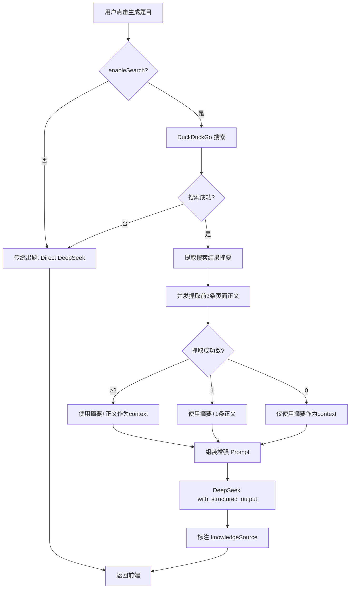

# AI 出题优化方案 —— 搜索增强（Search-Augmented Generation）

> **项目名称**：AI闯关学园（yuAIRUN）
> **文档版本**：v1.0
> **编写日期**：2026-06-21
> **关联文档**：[方案设计文档.md](./方案设计文档.md)、[需求分析文档.md](../需求分析文档/需求分析文档.md)

---

## 目录

1. [问题分析](#1-问题分析)
2. [解决方案概述](#2-解决方案概述)
3. [搜索增强出题流程设计](#3-搜索增强出题流程设计)
4. [详细技术方案](#4-详细技术方案)
5. [API 接口变更](#5-api-接口变更)
6. [前端 UI 变更](#6-前端-ui-变更)
7. [实施计划](#7-实施计划)
8. [风险评估与降级策略](#8-风险评估与降级策略)

---

## 1. 问题分析

### 1.1 核心问题

```
┌─────────────────────────────────────────────────────────────┐
│                   当前出题流程（有缺陷）                       │
│                                                             │
│  用户输入 "Harness Engineering"                              │
│         │                                                    │
│         ▼                                                    │
│  ┌──────────────────┐                                        │
│  │   DeepSeek 直接出题 │ ← 模型训练数据有截止日期              │
│  │   （纯依赖模型知识） │    无法覆盖最新知识                   │
│  └────────┬─────────┘                                        │
│           │                                                   │
│           ▼                                                   │
│  ┌──────────────────┐                                        │
│  │   输出错误题目     │ ← 混淆为其他领域的知识                │
│  └──────────────────┘                                        │
└─────────────────────────────────────────────────────────────┘
```

### 1.2 根因分析

| 因素 | 说明 |
|------|------|
| **模型知识截止** | DeepSeek V3 的训练数据有固定截止日期，无法覆盖训练之后出现的新概念、新技术、新理论 |
| **纯模型依赖** | 当前 Prompt 仅包含用户输入的 topic，没有外部知识补充。模型只能凭"记忆"作答 |
| **知识混淆风险** | 对同名或相似名称的不同领域概念（如 Harness Engineering 在软件工程 vs 其他领域），模型容易张冠李戴 |
| **无事实校验** | 系统没有任何环节对 AI 输出的题目内容进行事实性校验 |

### 1.3 用户诉求

> 需求分析文档明确要求：
> - **"AI 自动从全网或者特定的信息源获取知识（比如网络搜索，或者解析文档 / 视频 / 网页）"**
> - **"AI 自动基于用户输入的一句话从全网获取知识补充"**

当前实现**完全缺失**这一环节，这是必须补上的核心功能。

---

## 2. 解决方案概述

### 2.1 核心理念：搜索增强生成（Search-Augmented Generation）

在调用 DeepSeek 出题**之前**，先通过 Web 搜索获取与用户 Topic 相关的**最新资料**，将这些资料作为"参考材料"注入 Prompt，让 DeepSeek **基于搜索到的材料**来出题，而非仅凭模型自身的知识。

### 2.2 整体架构变化

```
┌────────────────────────────────────────────────────────────┐
│                   优化后的出题流程                           │
│                                                            │
│  用户输入 Topic                                              │
│         │                                                   │
│         ▼                                                   │
│  ┌──────────────────┐                                       │
│  │  ① Web Search    │ ← DuckDuckGo（免费，无需 API Key）   │
│  │  搜索最新资料     │    搜索前 5 条结果                    │
│  └──────┬───────────┘                                       │
│         │ 搜索结果摘要                                       │
│         ▼                                                   │
│  ┌──────────────────┐                                       │
│  │  ② 内容提取      │ ← 请求超时控制在 5s 内               │
│  │  抓取页面正文     │    使用 BeautifulSoup 提取纯文本      │
│  └──────┬───────────┘                                       │
│         │ 提取的文本内容                                     │
│         ▼                                                   │
│  ┌──────────────────┐                                       │
│  │  ③ Context 组装  │ ← 搜索材料 + Topic → 增强 Prompt    │
│  │  构建搜索增强Prompt│   控制 context 在 4000 tokens 以内  │
│  └──────┬───────────┘                                       │
│         │ 增强 Prompt                                        │
│         ▼                                                   │
│  ┌──────────────────┐                                       │
│  │  ④ DeepSeek 出题 │ ← 基于搜索材料出题                   │
│  │  with_structured │    要求"基于以下参考资料"              │
│  │  _output 输出    │    标注知识来源                        │
│  └──────┬───────────┘                                       │
│         │ 题目 JSON                                          │
│         ▼                                                   │
│  返回前端                                                   │
└────────────────────────────────────────────────────────────┘
```

### 2.3 与传统 RAG 的区别

| 维度 | 传统 RAG（检索增强生成） | 本方案（搜索增强出题） |
|------|------------------------|---------------------|
| 知识来源 | 私有知识库（向量数据库） | 公开互联网（实时搜索） |
| 适用场景 | 企业培训、考试题库 | 学习最新/小众知识 |
| 实现复杂度 | 需要向量库 + Embedding | 只需搜索 API + 内容提取 |
| 实时性 | 取决于知识库更新频率 | **实时**，搜索即最新 |
| 本阶段 | Phase 2 扩展功能 | **当前要做的优化** |

---

## 3. 搜索增强出题流程设计

### 3.1 详细流程图

```
用户点击 "AI 生成题目"
       │
       ▼
┌──────────────────┐
│ 检查 enableSearch │────NO────▶ 传统出题流程（直接调 DeepSeek）
└────────┬─────────┘
         │ YES
         ▼
┌──────────────────┐
│ Web Search       │  ← 搜索 query: "{topic}" + "{subject}"
│ (DuckDuckGo)     │     取前 5 条结果
└────────┬─────────┘
         │
         ├── 搜索成功 ──▶ 提取标题 + 摘要 + URL
         │
         └── 搜索失败 ──▶ 降级：传统出题流程（不加搜索材料）
                           + 日志记录失败原因
         │
         ▼
┌──────────────────┐
│ 抓取页面内容      │  ← 对前 3 条结果抓取正文
│ (并发请求)        │     超时 5 秒/条
└────────┬─────────┘
         │
         ├── 抓取成功 ──▶ 提取纯文本，截取前 2000 字符
         │
         └── 抓取失败 ──▶ 只用摘要信息（标题+摘要）
         │
         ▼
┌──────────────────┐
│ 组装增强 Prompt   │  ← 将搜索结果格式化为"参考资料"段落
│                   │     附在 System Prompt 中
└────────┬─────────┘
         │
         ▼
┌──────────────────┐
│ DeepSeek 出题     │  ← with_structured_output
│ (基于参考资料)    │     要求每题标注 knowledgeSource
└────────┬─────────┘
         │
         ▼
┌──────────────────┐
│ 返回题目 JSON     │  ← 新增字段表明是否使用了搜索增强
└──────────────────┘
```

### 3.2 Prompt 增强策略

#### 当前 Prompt（仅依赖模型知识）

```
你是一位专业的出题专家...
请根据以下学习内容，生成 {count} 道题目。
## 知识点/学习内容：
{topic}
```

#### 增强后 Prompt（注入搜索材料）

```
你是一位专业的出题专家...

【重要】你必须基于以下参考资料来出题，确保题目的内容准确、时效性强。
如果参考资料与你的训练知识有冲突，以参考资料为准。

## 参考资料（来自实时网络搜索）
以下是从互联网搜索到的与 "{topic}" 相关的最新资料：

--- 搜索结果 1 ---
标题：{search_result_1_title}
来源：{search_result_1_url}
内容摘要：{search_result_1_snippet}

--- 搜索结果 2 ---
标题：{search_result_2_title}
来源：{search_result_2_url}
内容摘要：{search_result_2_snippet}

...

## 出题要求
1. 必须基于参考资料出题，不要编造参考资料中没有的信息
2. 每道题需标注知识点来源（如：基于搜索结果 X）
3. 如果参考资料不足以生成足够题目，可以结合你的知识补充，但需标注哪些是基于搜索、哪些是基于模型知识

## 知识点/学习内容：
{topic}
```

---

## 4. 详细技术方案

### 4.1 后端新增文件与修改

#### 4.1.1 🔵 新增：`app/utils/web_search.py` — Web 搜索工具

**功能**：封装 DuckDuckGo 搜索，返回格式化搜索结果

```python
"""Web 搜索工具，用于搜索增强出题"""

from duckduckgo_search import DDGS
from typing import Optional


class SearchResult:
    """搜索结果"""
    title: str
    url: str
    snippet: str


async def search_web(query: str, max_results: int = 5) -> list[SearchResult]:
    """
    搜索互联网，返回最新的相关信息
    
    Args:
        query: 搜索关键词
        max_results: 最大返回结果数
        
    Returns:
        搜索结果列表
    """
    # 使用 DuckDuckGo 搜索（免费，无需 API Key）
    with DDGS() as ddgs:
        results = list(ddgs.text(query, max_results=max_results))
    
    return [
        SearchResult(
            title=r.get("title", ""),
            url=r.get("href", ""),
            snippet=r.get("body", ""),
        )
        for r in results
    ]
```

#### 4.1.2 🔵 新增：`app/utils/content_extractor.py` — 网页内容提取工具

**功能**：抓取搜索结果中的网页内容，提取正文纯文本

```python
"""网页内容提取工具"""

import httpx
from bs4 import BeautifulSoup


async def extract_page_content(url: str, max_chars: int = 2000) -> str:
    """
    抓取网页并提取正文内容
    
    Args:
        url: 网页 URL
        max_chars: 最大提取字符数
        
    Returns:
        提取的纯文本内容
    """
    headers = {
        "User-Agent": "Mozilla/5.0 (Windows NT 10.0; Win64; x64) "
                      "AppleWebKit/537.36 (KHTML, like Gecko) "
                      "Chrome/120.0.0.0 Safari/537.36"
    }
    try:
        async with httpx.AsyncClient(timeout=5.0) as client:
            resp = await client.get(url, headers=headers, follow_redirects=True)
            resp.raise_for_status()
        
        soup = BeautifulSoup(resp.text, "lxml")
        
        # 移除无用标签
        for tag in soup(["script", "style", "nav", "footer", "header", "aside"]):
            tag.decompose()
        
        text = soup.get_text(separator="\n", strip=True)
        return text[:max_chars]
    except Exception:
        return ""  # 抓取失败返回空字符串，不影响主流程
```

#### 4.1.3 🔵 新增：`app/services/search_service.py` — 搜索增强服务

**功能**：编排搜索 + 内容提取 + 结果格式化

```python
"""搜索增强服务 — 编排搜索、内容提取和格式化"""

from app.utils.web_search import search_web
from app.utils.content_extractor import extract_page_content


class SearchContext:
    """搜索增强上下文"""
    enabled: bool = False      # 是否启用了搜索
    results_count: int = 0     # 搜索结果数
    content_sources: list[str] = []  # 内容来源 URL
    formatted_context: str = ""      # 格式化后的上下文文本


async def build_search_context(
    topic: str,
    subject: str,
    enable_search: bool = True,
) -> SearchContext:
    """
    构建搜索增强上下文
    
    Args:
        topic: 用户输入的知识点
        subject: 学科类别
        enable_search: 是否启用搜索
        
    Returns:
        搜索增强上下文
    """
    context = SearchContext()
    if not enable_search:
        return context
    
    try:
        # 1. 搜索
        search_query = f"{topic} {subject}"
        results = await search_web(search_query, max_results=5)
        
        if not results:
            return context
        
        context.enabled = True
        context.results_count = len(results)
        
        # 2. 格式化搜索结果
        lines = []
        for i, r in enumerate(results, 1):
            lines.append(f"--- 参考资料 {i} ---")
            lines.append(f"标题：{r.title}")
            lines.append(f"来源：{r.url}")
            lines.append(f"内容：{r.snippet}")
            
            # 3. 尝试抓取正文（前 3 条）
            if i <= 3:
                content = await extract_page_content(r.url, max_chars=1500)
                if content:
                    lines.append(f"详细内容：{content}")
                    context.content_sources.append(r.url)
            
            lines.append("")
        
        context.formatted_context = "\n".join(lines)
        
    except Exception:
        # 搜索失败不阻断主流程，降级为传统出题
        pass
    
    return context
```

#### 4.1.4 🔴 修改：`app/prompts/quiz_prompt.py` — 新增搜索增强 Prompt

在现有 Prompt 基础上，新增**搜索增强版本**的 Prompt 模板：

```python
"""出题 Prompt 模板"""

# ... 保留现有 QUIZ_SYSTEM_PROMPT ...

# 新增：搜索增强专用 Prompt
QUIZ_SYSTEM_PROMPT_WITH_SEARCH = """你是一位专业的出题专家，擅长根据学习内容生成高质量的练习题。

## 核心原则
【重要】你的回答必须严格基于以下"参考资料"中的信息来生成题目。
- 如果参考资料与你的训练知识有冲突，以参考资料为准
- 不要编造参考资料中没有的信息
- 如果参考资料不足以生成足够的题目，可以结合你的知识补充，
  但必须在题目的 knowledgeSource 字段中标注"基于参考资料"或"基于模型知识"

## 参考资料（来自实时网络搜索）
以下是关于"{topic}"的最新网络搜索结果，请仔细阅读并基于这些内容出题：

{search_context}

## 要求
1. 题目必须准确、专业、无歧义，基于参考资料
2. 选项必须合理，干扰项要有迷惑性但不能误导
3. 解析必须详细、清晰，帮助学生理解知识点
4. 难度分布要合理
5. 每道题必须标注 knowledgeSource：
   - "web_search" — 基于搜索结果出题
   - "model_knowledge" — 基于模型自身知识出题

## 难度定义
- easy（简单）：考查基础概念和定义的记忆
- medium（中等）：考查概念的理解和简单应用
- hard（困难）：考查综合分析、比较和实际应用

## 输出格式
严格按照 JSON 格式输出...
"""
```

#### 4.1.5 🔴 修改：`app/models/quiz.py` — 新增请求字段和题目来源字段

```python
# 在 GenerateQuizRequest 中新增字段
class GenerateQuizRequest(BaseModel):
    """生成题目请求"""
    subject: str = Field(description="学科类别")
    topic: str = Field(description="知识点/内容描述")
    count: int = Field(default=5, ge=1, le=20, description="题目数量")
    difficulty: Literal["easy", "medium", "hard", "mixed"] = Field(default="medium")
    type: Literal["single", "multiple", "judge", "mixed"] = Field(default="single")
    # 🆕 新增：是否启用搜索增强
    enableSearch: bool = Field(default=True, description="是否启用搜索增强")

# 在 QuizQuestion 中新增字段
class QuizQuestion(BaseModel):
    """单道题目"""
    # ... 现有字段 ...
    # 🆕 新增：知识来源标注
    knowledgeSource: str = Field(
        default="model_knowledge",
        description="知识来源: web_search=基于搜索结果, model_knowledge=基于模型知识",
    )
```

#### 4.1.6 🔴 修改：`app/chains/quiz_chain.py` — 新增搜索增强出题链

```python
# 新增：支持搜索增强的出题链
class SearchAugmentedQuizChain:
    """搜索增强出题链 - 先搜索后出题"""

    def __init__(self, llm, prompt):
        self.llm = llm
        self.prompt = prompt

    async def ainvoke(self, inputs: dict) -> QuizResponse:
        # 1. 搜索增强：获取网络资料
        from app.services.search_service import build_search_context
        search_ctx = await build_search_context(
            topic=inputs.get("topic", ""),
            subject=inputs.get("subject", ""),
            enable_search=inputs.get("enableSearch", True),
        )

        # 2. 组装增强后的 Prompt
        chain_inputs = {**inputs}
        if search_ctx.enabled:
            chain_inputs["search_context"] = search_ctx.formatted_context
            chain_inputs["enableSearch"] = True
        else:
            chain_inputs["search_context"] = ""
            chain_inputs["enableSearch"] = False

        # 3. 调用 LLM
        chain = self.prompt | self.llm
        result = await chain.ainvoke(chain_inputs)
        parsed = parse_json_response(result.content)
        return QuizResponse(**parsed)
```

#### 4.1.7 🔴 修改：`app/services/quiz_service.py` — 集成搜索增强

```python
async def generate_quiz(request: GenerateQuizRequest) -> GenerateQuizResponse:
    # ... 现有逻辑 ...
    
    # 根据 enableSearch 选择不同的链
    if request.enableSearch and not settings.use_mock_llm:
        # 搜索增强出题链
        chain = create_search_augmented_quiz_chain()
    else:
        # 传统出题链
        chain = create_quiz_chain(use_mock=settings.use_mock_llm)
    
    result = await chain.ainvoke({
        "subject": request.subject,
        "topic": request.topic,
        "count": request.count,
        "difficulty": difficulty,
        "type": q_type,
        "enableSearch": request.enableSearch,
    })
    # ...
```

#### 4.1.8 🟢 修改：`requirements.txt` — 新增依赖

```
# Web 搜索
duckduckgo_search>=7.5.0
# HTML 内容提取
beautifulsoup4>=4.13.0
lxml>=5.3.0
```

### 4.2 前端修改

#### 4.2.1 🟢 修改：`types/api.ts` — 新增请求字段

```typescript
/** 生成题目请求 */
export interface GenerateQuizRequest {
  subject: string
  topic: string
  count: number
  difficulty: string
  type: string
  enableSearch?: boolean  // 🆕 是否启用搜索增强
}
```

#### 4.2.2 🟢 修改：`pages/topic-input/index.tsx` — 新增联网搜索开关 UI

在现有页面的"题目配置"区域下方，新增搜索增强开关：

```tsx
{/* 🆕 搜索增强开关 */}
<View className='search-enhance-section'>
  <View className='search-enhance-header'>
    <View className='search-enhance-info'>
      <Text className='search-enhance-icon'>🌐</Text>
      <View className='search-enhance-text'>
        <Text className='search-enhance-title'>联网搜索增强</Text>
        <Text className='search-enhance-desc'>
          开启后 AI 将从互联网获取最新资料辅助出题，适合学习最新知识
        </Text>
      </View>
    </View>
    <Switch 
      className='search-enhance-switch'
      checked={enableSearch}
      onChange={(e) => setEnableSearch(e.detail.value)}
      color='#C97B6B'
    />
  </View>
</View>
```

#### 4.2.3 🟢 修改：`pages/topic-input/index.scss` — 搜索增强开关样式

```scss
.search-enhance-section {
  margin: 16px 0;
  padding: 14px 16px;
  background: #fff;
  border-radius: 16px;
  box-shadow: 0 2px 8px rgba(0, 0, 0, 0.06);
}

.search-enhance-header {
  display: flex;
  justify-content: space-between;
  align-items: center;
}

.search-enhance-info {
  display: flex;
  align-items: center;
  gap: 10px;
  flex: 1;
}

.search-enhance-icon {
  font-size: 24px;
}

.search-enhance-text {
  display: flex;
  flex-direction: column;
  gap: 2px;
}

.search-enhance-title {
  font-size: 15px;
  font-weight: 600;
  color: #333;
}

.search-enhance-desc {
  font-size: 12px;
  color: #999;
  line-height: 1.4;
}
```

### 4.3 搜索质量优化策略

| 策略 | 说明 |
|------|------|
| **搜索 Query 优化** | 使用 `topic + subject` 组合作为搜索关键词，提高搜索准确率 |
| **搜索结果筛选** | 优先选择高权威性来源（如 Wikipedia、官方文档、学术网站） |
| **内容截断策略** | 每条结果正文截取前 1500 字符，总搜索上下文控制在 4000 tokens 以内 |
| **来源多样性** | 确保 5 条结果来自不同域名，避免单一信源偏差 |
| **抓取超时保护** | 页面抓取设置 5 秒超时，超时则只使用搜索摘要 |
| **搜索失败降级** | 搜索失败时静默降级为传统出题，用户无感知 |

---

## 5. API 接口变更

### 5.1 请求体变更

```json
{
  "subject": "软件工程",
  "topic": "Harness Engineering",
  "count": 10,
  "difficulty": "medium",
  "type": "single",
  "enableSearch": true    // 🆕 新增字段，默认 true
}
```

### 5.2 响应体变更

```json
{
  "success": true,
  "data": {
    "questions": [
      {
        "id": "q_001",
        "type": "single",
        "question": "...",
        "options": [...],
        "answer": "...",
        "explanation": "...",
        "difficulty": "medium",
        "knowledgePoint": "Harness Engineering",
        "knowledgeSource": "web_search"   // 🆕 新增：知识来源
      }
    ],
    "metadata": {
      "subject": "软件工程",
      "topic": "Harness Engineering",
      "generatedAt": "...",
      "model": "deepseek-chat",
      "searchEnhanced": true,              // 🆕 新增：是否使用了搜索增强
      "searchSources": [                   // 🆕 新增：搜索来源
        "https://...",
        "https://..."
      ]
    }
  }
}
```

---

## 6. 前端 UI 变更

### 6.1 出题页面新增"联网搜索增强"开关

在现有的"题目配置"区域下方，增加一个开关控制：

```
┌─────────────────────────────────────┐
│  📂 学科类别                          │
│  ┌─────────────────────────────┐    │
│  │ 例如：软件工程               │    │
│  └─────────────────────────────┘    │
│                                      │
│  📝 知识点内容                        │
│  ┌─────────────────────────────┐    │
│  │ Harness Engineering...      │    │
│  └─────────────────────────────┘    │
│                                      │
│  题目数量    难度                      │
│  [5题] [10题] [15题]  [简单][中等]    │
│                                      │
│  ┌────────────────────────────────┐  │
│  │ 🌐 联网搜索增强             🔘 │  │
│  │ 开启后 AI 将从互联网获取最新   │  │
│  │ 资料辅助出题，适合学习最新知识 │  │
│  └────────────────────────────────┘  │
│                                      │
│  [🤖 AI 生成题目]                    │
└─────────────────────────────────────┘
```

### 6.2 Loading 阶段新增"搜索中"提示

在 LoadingSpinner 组件中，当启用搜索增强时增加"正在搜索最新资料..."的分阶段进度提示：

| 阶段 | 文案 | 预计耗时 |
|------|------|---------|
| 1 | 🌐 正在搜索最新资料... | 2~5 秒 |
| 2 | 📄 正在获取网页内容... | 3~8 秒 |
| 3 | 🧠 AI 正在分析资料并出题... | 10~20 秒 |

---

## 7. 实施计划

### Phase 1：后端搜索能力建设（预计 1 天）

| 任务 | 文件 | 工作量 |
|------|------|--------|
| 新增搜索工具 | `app/utils/web_search.py` | 小 |
| 新增内容提取工具 | `app/utils/content_extractor.py` | 小 |
| 新增搜索增强服务 | `app/services/search_service.py` | 中 |
| 修改 Prompt 模板 | `app/prompts/quiz_prompt.py` | 小 |
| 修改数据模型 | `app/models/quiz.py` | 小 |
| 修改出题链 | `app/chains/quiz_chain.py` | 中 |
| 修改出题服务 | `app/services/quiz_service.py` | 小 |
| 更新依赖 | `requirements.txt` | 小 |

### Phase 2：前端交互优化（预计 0.5 天）

| 任务 | 文件 | 工作量 |
|------|------|--------|
| 新增搜索开关 UI | `pages/topic-input/index.tsx` | 小 |
| 新增开关样式 | `pages/topic-input/index.scss` | 小 |
| 更新 API 类型 | `types/api.ts` | 小 |
| 更新 Loading 提示 | `components/LoadingSpinner/index.tsx` | 小 |

### Phase 3：测试与调优（预计 0.5 天）

| 任务 | 说明 |
|------|------|
| 搜索质量验证 | 测试 5 个以上不同领域的关键词，验证搜索相关性 |
| 超时测试 | 验证搜索超时不影响主流程 |
| 降级测试 | 关闭搜索增强，验证传统出题流程正常 |
| Prompt 调优 | 根据生成质量调整 Prompt 措辞 |

---

## 8. 风险评估与降级策略

### 8.1 风险矩阵

| 风险 | 影响 | 概率 | 应对策略 |
|------|------|------|---------|
| DuckDuckGo 搜索被限制/封禁 | 搜索增强不可用 | 中 | ① 自动降级为传统出题<br>② 预留 Bing Search API 作为备选 |
| 搜索结果不相关 | 出题质量差 | 中 | ① 优化搜索 Query（topic + subject）<br>② 增加来源域名白名单 |
| 页面抓取耗时过长 | 总响应时间增加 | 高 | ① 5 秒硬超时<br>② 只抓取前 3 条<br>③ 抓取失败用搜索摘要兜底 |
| 搜索内容过多超出 Token 限制 | LLM 调用失败 | 低 | ① 严格截断每条 1500 字符<br>② 总 context 控制在 4000 tokens 以内 |
| DuckDuckGo 搜索结果不足 | 搜索增强效果差 | 低 | ① 搜索结果 < 3 条时自动降级为传统出题<br>② 在 metadata 中标注搜索状态 |

### 8.2 降级策略路线图

```
搜索增强开启
    │
    ▼
┌──────────────────┐
│ DuckDuckGo 搜索   │──失败──▶ 降级：传统出题（无搜索材料）
└────────┬─────────┘              用户无感知
         │ 成功
         ▼
┌──────────────────┐
│ 结果数量 ≥ 3     │──否──▶ 降级：只用搜索摘要出题
└────────┬─────────┘
         │ 是
         ▼
┌──────────────────┐
│ 页面抓取          │──超时/失败──▶ 使用搜索摘要出题
└────────┬─────────┘
         │ 成功
         ▼
┌──────────────────┐
│ 完整搜索增强出题   │
│ = 摘要 + 正文    │
└──────────────────┘
```

### 8.3 备选搜索源

如果 DuckDuckGo 不可用或效果不佳，预留以下备选方案：

| 搜索源 | 费用 | 接入方式 | 切换条件 |
|--------|------|---------|---------|
| **Bing Web Search API** | 免费层 (1000次/月) | `httpx` 直接调用 REST API | DuckDuckGo 连续失败 3 次 |
| **SerpAPI** | 付费 ($50/月 5000次) | `google-search-results` pip 包 | 需要更精准的搜索结果 |
| **Tavily** | 付费 (1000次/月免费) | `tavily-python` pip 包 | 需要专门为 AI 优化的搜索 |

---

## 附录

### A. 完整的搜索增强流程图（Mermaid）



### B. 搜索质量验证用例

| 测试用例 | 预期结果 |
|---------|---------|
| `Harness Engineering` | 应返回软件工程/CI-CD 领域的最新资料，而非其他领域 |
| `React 19 Server Components` | 应返回 React 19 新特性的最新文档 |
| `GPT-5 最新进展 2026` | 应返回 2026 年的最新新闻报道 |
| `量子计算最新突破` | 应返回近期的科研成果 |

---

> **文档版本**：v1.0
> **编写日期**：2026-06-21
> **状态**：待评审
