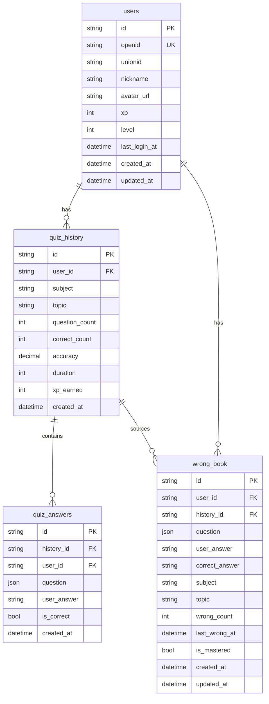

# AI刷题小程序 - 用户系统方案设计文档

> **项目名称**：AI刷题小程序（AI Quiz Mini-Program）
> **版本**：v1.0
> **编写日期**：2026-06-15
> **关联文档**：[需求分析文档-用户系统](../需求分析文档/需求分析文档-用户系统.md)、[方案设计文档-核心MVP](./方案设计文档.md)
> **UI原型**：[prototype-core.html](../../prototype/原型图/prototype-core.html)
> **技术栈**：Taro 4 + React + TypeScript + FastAPI + LangChain + DeepSeek + **MySQL + SQLAlchemy**

---

## 目录

1. [数据库设计](#1-数据库设计)
2. [后端模块架构](#2-后端模块架构)
3. [API接口详细设计](#3-api接口详细设计)
4. [JWT认证流程](#4-jwt认证流程)
5. [前端页面设计](#5-前端页面设计)
6. [分步实施计划](#6-分步实施计划)
7. [依赖与环境配置](#7-依赖与环境配置)

---

## 1. 数据库设计

### 1.1 技术选型：MySQL + SQLAlchemy 2.0

| 决策 | 原因 |
|------|------|
| **MySQL** | 用户系统涉及大量关系型数据（用户、闯关记录、错题、题目），关系型数据库最合适 |
| **SQLAlchemy 2.0** | Python 生态最成熟的 ORM，支持异步（通过 `aiomysql`），与 FastAPI 异步架构完美匹配 |
| **alembic** | 数据库迁移工具，支持版本化管理表结构变更 |

> **为什么不用 JSON 文件？**
> 用户数据之间存在复杂的关系查询需求（如「查询某个用户正确率最高的学科 Top 5」），JSON 文件需要全量加载到内存中过滤，效率极低且不支持并发写入。MySQL 通过索引和 SQL 查询可以高效支持这些场景。

### 1.2 数据库表结构总览

```
┌─────────────────────────────────────────────────────────────────┐
│                        yuairun 数据库                            │
├─────────────────────────────────────────────────────────────────┤
│                                                                 │
│  ┌──────────────┐    ┌──────────────────┐    ┌──────────────┐   │
│  │    users      │    │   quiz_history    │    │  wrong_book  │   │
│  │  (用户表)     │───▶│  (闯关历史表)     │    │  (错题本表)   │   │
│  └──────────────┘    └──────────────────┘    └──────────────┘   │
│         │                      │                                 │
│         │                      │                                 │
│         │              ┌───────┴────────┐                       │
│         │              │  quiz_answers   │                       │
│         │              │ (答题详情表)     │                       │
│         │              └────────────────┘                       │
│         │                                                       │
│         └──────────────────────────────────────────────────────┘ │
│                           一对多关系                               │
└─────────────────────────────────────────────────────────────────┘
```

### 1.3 各表详细设计

#### 1.3.1 `users` — 用户表

| 字段名 | 类型 | 约束 | 说明 |
|--------|------|------|------|
| `id` | VARCHAR(32) | PK | 用户唯一ID，格式 `u_xxx` |
| `openid` | VARCHAR(128) | UNIQUE, NOT NULL | 微信 openid |
| `unionid` | VARCHAR(128) | NULLABLE | 微信 unionid（多平台时使用） |
| `nickname` | VARCHAR(64) | NOT NULL, DEFAULT '' | 微信昵称 |
| `avatar_url` | VARCHAR(512) | NOT NULL, DEFAULT '' | 微信头像 URL |
| `xp` | INT | NOT NULL, DEFAULT 0 | 经验值 |
| `level` | INT | NOT NULL, DEFAULT 1 | 等级 |
| `last_login_at` | DATETIME | NULLABLE | 最后登录时间 |
| `is_deleted` | TINYINT(1) | NOT NULL, DEFAULT 0 | 软删除标记 |
| `created_at` | DATETIME | NOT NULL | 创建时间 |
| `updated_at` | DATETIME | NOT NULL | 更新时间 |

**索引**：
- `idx_openid` ON `openid`（唯一索引）

**DDL**：
```sql
CREATE TABLE users (
    id VARCHAR(32) PRIMARY KEY,
    openid VARCHAR(128) NOT NULL UNIQUE,
    unionid VARCHAR(128) DEFAULT NULL,
    nickname VARCHAR(64) NOT NULL DEFAULT '',
    avatar_url VARCHAR(512) NOT NULL DEFAULT '',
    xp INT NOT NULL DEFAULT 0,
    level INT NOT NULL DEFAULT 1,
    last_login_at DATETIME DEFAULT NULL,
    is_deleted TINYINT(1) NOT NULL DEFAULT 0,
    created_at DATETIME NOT NULL,
    updated_at DATETIME NOT NULL,
    INDEX idx_openid (openid)
) ENGINE=InnoDB DEFAULT CHARSET=utf8mb4 COLLATE=utf8mb4_unicode_ci;
```

#### 1.3.2 `quiz_history` — 闯关历史表

| 字段名 | 类型 | 约束 | 说明 |
|--------|------|------|------|
| `id` | VARCHAR(32) | PK | 记录ID，格式 `h_xxx` |
| `user_id` | VARCHAR(32) | FK → users.id | 用户ID |
| `subject` | VARCHAR(64) | NOT NULL | 学科 |
| `topic` | VARCHAR(256) | NOT NULL | 知识点 |
| `question_count` | INT | NOT NULL | 总题数 |
| `correct_count` | INT | NOT NULL | 正确数 |
| `accuracy` | DECIMAL(4,3) | NOT NULL | 正确率 (0.000 ~ 1.000) |
| `duration` | INT | NOT NULL, DEFAULT 0 | 答题用时（秒） |
| `xp_earned` | INT | NOT NULL, DEFAULT 0 | 获得经验值 |
| `created_at` | DATETIME | NOT NULL | 创建时间 |

**索引**：
- `idx_user_created` ON `user_id`, `created_at` DESC（用户按时间查询历史）
- `idx_user_subject` ON `user_id`, `subject`（按学科筛选）

**DDL**：
```sql
CREATE TABLE quiz_history (
    id VARCHAR(32) PRIMARY KEY,
    user_id VARCHAR(32) NOT NULL,
    subject VARCHAR(64) NOT NULL,
    topic VARCHAR(256) NOT NULL,
    question_count INT NOT NULL,
    correct_count INT NOT NULL,
    accuracy DECIMAL(4,3) NOT NULL,
    duration INT NOT NULL DEFAULT 0,
    xp_earned INT NOT NULL DEFAULT 0,
    created_at DATETIME NOT NULL,
    FOREIGN KEY (user_id) REFERENCES users(id),
    INDEX idx_user_created (user_id, created_at DESC),
    INDEX idx_user_subject (user_id, subject)
) ENGINE=InnoDB DEFAULT CHARSET=utf8mb4 COLLATE=utf8mb4_unicode_ci;
```

#### 1.3.3 `quiz_answers` — 答题详情表

| 字段名 | 类型 | 约束 | 说明 |
|--------|------|------|------|
| `id` | VARCHAR(32) | PK | 记录ID，格式 `qa_xxx` |
| `history_id` | VARCHAR(32) | FK → quiz_history.id | 关联的闯关记录ID |
| `user_id` | VARCHAR(32) | FK → users.id | 用户ID |
| `question` | JSON | NOT NULL | 完整题目对象（含选项、答案、解析） |
| `user_answer` | VARCHAR(256) | NOT NULL | 用户的答案 |
| `is_correct` | TINYINT(1) | NOT NULL | 是否正确 |
| `created_at` | DATETIME | NOT NULL | 创建时间 |

**索引**：
- `idx_history` ON `history_id`
- `idx_user_correct` ON `user_id`, `is_correct`（用于统计正确数/错题）

**DDL**：
```sql
CREATE TABLE quiz_answers (
    id VARCHAR(32) PRIMARY KEY,
    history_id VARCHAR(32) NOT NULL,
    user_id VARCHAR(32) NOT NULL,
    question JSON NOT NULL,
    user_answer VARCHAR(256) NOT NULL,
    is_correct TINYINT(1) NOT NULL,
    created_at DATETIME NOT NULL,
    FOREIGN KEY (history_id) REFERENCES quiz_history(id) ON DELETE CASCADE,
    FOREIGN KEY (user_id) REFERENCES users(id),
    INDEX idx_history (history_id),
    INDEX idx_user_correct (user_id, is_correct)
) ENGINE=InnoDB DEFAULT CHARSET=utf8mb4 COLLATE=utf8mb4_unicode_ci;
```

#### 1.3.4 `wrong_book` — 错题本表

| 字段名 | 类型 | 约束 | 说明 |
|--------|------|------|------|
| `id` | VARCHAR(32) | PK | 记录ID，格式 `wb_xxx` |
| `user_id` | VARCHAR(32) | FK → users.id | 用户ID |
| `history_id` | VARCHAR(32) | FK → quiz_history.id | 来源闯关记录ID |
| `question` | JSON | NOT NULL | 完整题目对象 |
| `user_answer` | VARCHAR(256) | NOT NULL | 用户当时的选择 |
| `correct_answer` | VARCHAR(256) | NOT NULL | 正确答案 |
| `subject` | VARCHAR(64) | NOT NULL | 学科 |
| `topic` | VARCHAR(256) | NOT NULL | 知识点 |
| `wrong_count` | INT | NOT NULL, DEFAULT 1 | 答错次数（累计） |
| `last_wrong_at` | DATETIME | NOT NULL | 最近一次答错时间 |
| `is_mastered` | TINYINT(1) | NOT NULL, DEFAULT 0 | 是否已掌握 |
| `created_at` | DATETIME | NOT NULL | 首次加入错题本时间 |
| `updated_at` | DATETIME | NOT NULL | 更新时间 |

**索引**：
- `idx_user_subject` ON `user_id`, `subject`
- `idx_user_mastered` ON `user_id`, `is_mastered`

**DDL**：
```sql
CREATE TABLE wrong_book (
    id VARCHAR(32) PRIMARY KEY,
    user_id VARCHAR(32) NOT NULL,
    history_id VARCHAR(32) NOT NULL,
    question JSON NOT NULL,
    user_answer VARCHAR(256) NOT NULL,
    correct_answer VARCHAR(256) NOT NULL,
    subject VARCHAR(64) NOT NULL,
    topic VARCHAR(256) NOT NULL,
    wrong_count INT NOT NULL DEFAULT 1,
    last_wrong_at DATETIME NOT NULL,
    is_mastered TINYINT(1) NOT NULL DEFAULT 0,
    created_at DATETIME NOT NULL,
    updated_at DATETIME NOT NULL,
    FOREIGN KEY (user_id) REFERENCES users(id),
    FOREIGN KEY (history_id) REFERENCES quiz_history(id) ON DELETE CASCADE,
    INDEX idx_user_subject (user_id, subject),
    INDEX idx_user_mastered (user_id, is_mastered)
) ENGINE=InnoDB DEFAULT CHARSET=utf8mb4 COLLATE=utf8mb4_unicode_ci;
```

### 1.4 ER 关系图



### 1.5 XP 计算与等级对照

```sql
-- 等级对照表（代码中常量定义，不建表）
-- Level 1: 0 XP       🧑‍🎓 初学者
-- Level 2: 100 XP     📚 学徒
-- Level 3: 300 XP     🔍 探究者
-- Level 4: 600 XP     🧠 学者
-- Level 5: 1000 XP    🏆 大师
-- Level 6: 2000 XP    👑 传奇
```

**XP 获取规则**：
| 行为 | XP 奖励 |
|------|---------|
| 答对一题 | +10 XP |
| 连续答题（第 2 题起） | +5 XP/题（额外奖励） |
| 首次完成闯关 | +50 XP（一次性） |
| 正确率 100% 完成闯关 | +20 XP（额外奖励） |

**等级计算公式**：
```python
def calculate_level(xp: int) -> int:
    LEVEL_THRESHOLDS = [0, 100, 300, 600, 1000, 2000]
    for level, threshold in enumerate(LEVEL_THRESHOLDS, 1):
        if xp < threshold:
            return level - 1
    return len(LEVEL_THRESHOLDS)

def get_level_title(level: int) -> str:
    TITLES = ['', '初学者', '学徒', '探究者', '学者', '大师', '传奇']
    return TITLES[level] if level < len(TITLES) else '传奇'
```

---

## 2. 后端模块架构

### 2.1 新增/修改的文件结构

```
yuairun-backend/
├── app/
│   ├── main.py                          # [修改] 注册新路由 + MySQL 初始化
│   ├── config.py                        # [修改] 增加 MySQL/JWT/微信配置
│   │
│   ├── api/v1/endpoints/
│   │   ├── health.py                    # (不变)
│   │   ├── quiz.py                      # (不变)
│   │   └── user.py                      # 🆕 用户 API 路由
│   │
│   ├── models/                          # Pydantic 数据模型（API 请求/响应）
│   │   ├── quiz.py                      # (不变)
│   │   ├── report.py                    # (不变)
│   │   └── user.py                      # 🆕 用户相关 Pydantic 模型
│   │
│   ├── db/                              # 🆕 数据库层
│   │   ├── __init__.py
│   │   ├── session.py                   # 🆕 数据库连接与会话管理
│   │   └── models/                      # 🆕 SQLAlchemy ORM 模型
│   │       ├── __init__.py
│   │       ├── user.py                  # 🆕 User ORM 模型
│   │       ├── quiz_history.py          # 🆕 QuizHistory ORM 模型
│   │       ├── quiz_answer.py           # 🆕 QuizAnswer ORM 模型
│   │       └── wrong_book.py            # 🆕 WrongBook ORM 模型
│   │
│   ├── services/
│   │   ├── quiz_service.py              # (不变)
│   │   ├── report_service.py            # (不变)
│   │   └── user_service.py              # 🆕 用户业务逻辑
│   │
│   └── utils/
│       ├── mock_llm.py                  # (不变)
│       └── auth.py                      # 🆕 JWT 工具函数
│
├── alembic/                             # 🆕 数据库迁移目录
│   └── versions/                        # 迁移脚本
├── alembic.ini                          # 🆕 Alembic 配置
│
├── requirements.txt                     # [修改] 增加 MySQL 依赖
├── .env                                 # [修改] 增加 MySQL/JWT 配置
└── .env.example                         # [修改] 同步更新
```

### 2.2 架构分层说明

```
┌───────────────────────────────────────────────┐
│               API 路由层 (api/endpoints)        │
│    负责：请求接收、参数校验、响应返回           │
│    特点：薄层，仅做路由分发                     │
├───────────────────────────────────────────────┤
│               业务逻辑层 (services)             │
│    负责：核心业务逻辑、数据校验、事务管理       │
│    特点：调用 ORM 层，处理业务规则              │
├───────────────────────────────────────────────┤
│              ORM 数据层 (db/models)             │
│    负责：SQLAlchemy ORM 模型定义               │
│    特点：映射表结构，提供查询接口               │
├───────────────────────────────────────────────┤
│              数据存储层 (MySQL)                 │
│    负责：物理数据持久化                         │
├───────────────────────────────────────────────┤
│               工具层 (utils)                    │
│    负责：JWT 工具、密码工具、通用函数           │
└───────────────────────────────────────────────┘
```

---

## 3. API 接口详细设计

### 3.1 接口总览

| 批次 | 方法 | 路径 | 说明 | 认证 |
|:----:|:----:|------|------|:----:|
| P0 | `POST` | `/api/user/login` | 微信登录/注册 | ❌ |
| P0 | `POST` | `/api/user/refresh-token` | 刷新 Token | ✅ |
| P1 | `GET` | `/api/user/profile` | 获取用户信息和统计 | ✅ |
| P1 | `PUT` | `/api/user/profile` | 更新用户信息 | ✅ |
| P2 | `GET` | `/api/user/history` | 分页获取闯关历史 | ✅ |
| P2 | `GET` | `/api/user/history/:id` | 获取单条闯关记录详情 | ✅ |
| P2 | `POST` | `/api/user/history/sync` | 批量同步闯关记录 | ✅ |
| P2 | `GET` | `/api/user/wrong-book` | 分页获取错题本 | ✅ |
| P2 | `POST` | `/api/user/wrong-book/sync` | 批量同步错题 | ✅ |
| P2 | `PUT` | `/api/user/wrong-book/:id/master` | 标记错题为"已掌握" | ✅ |
| P2 | `DELETE` | `/api/user/wrong-book/:id` | 从错题本删除 | ✅ |

### 3.2 P0 接口 — 用户登录认证

#### `POST /api/user/login`

| 项目 | 说明 |
|------|------|
| **功能** | 使用微信临时 code 登录/注册，返回 JWT Token |
| **是否需要认证** | ❌ 否 |

**请求体：**
```json
{
  "code": "微信临时登录凭证",
  "nickname": "小明（可选，首次登录注册时使用）",
  "avatarUrl": "https://thirdwx.qlogo.cn/...（可选）"
}
```

**处理逻辑：**
```
1. 接收 code
2. （模拟阶段）将 code 作为 openid 使用
3. 查 users 表：
   - 存在 → 更新 last_login_at，返回 Token
   - 不存在 → 创建新用户，返回 Token
4. 生成 JWT Token（有效期 30 天）
5. 返回 Token + 用户基本信息
```

**成功响应：**
```json
{
  "success": true,
  "data": {
    "token": "eyJhbGciOiJIUzI1NiIs...",
    "expiresIn": 2592000,
    "user": {
      "id": "u_abc123",
      "nickname": "小明",
      "avatarUrl": "https://thirdwx.qlogo.cn/...",
      "xp": 0,
      "level": 1,
      "levelTitle": "初学者",
      "isNewUser": true
    }
  }
}
```

#### `POST /api/user/refresh-token`

| 项目 | 说明 |
|------|------|
| **功能** | 用旧 Token 换取新 Token（延长有效期） |
| **是否需要认证** | ✅ 是 |

**请求体：**
```json
{
  "token": "旧 JWT Token"
}
```

**成功响应：**
```json
{
  "success": true,
  "data": {
    "token": "新 JWT Token",
    "expiresIn": 2592000
  }
}
```

### 3.3 P1 接口 — 个人中心与统计

#### `GET /api/user/profile`

| 项目 | 说明 |
|------|------|
| **功能** | 获取当前登录用户的详细信息和学习统计 |
| **是否需要认证** | ✅ 是 |

**处理逻辑：**
```
1. 从 Token 解析 user_id
2. 查询 users 表获取用户基本信息
3. 聚合查询统计信息：
   - totalQuizzes:  COUNT(quiz_history) WHERE user_id = ?
   - totalQuestions: SUM(question_count)
   - totalCorrect:   SUM(correct_count)
   - streakDays:     计算连续学习天数
   - lastActiveDate: MAX(created_at)
4. 返回合并数据
```

**成功响应：**
```json
{
  "success": true,
  "data": {
    "id": "u_abc123",
    "nickname": "小明",
    "avatarUrl": "https://...",
    "xp": 320,
    "level": 3,
    "levelTitle": "探究者",
    "nextLevelXp": 600,
    "stats": {
      "totalQuizzes": 42,
      "totalQuestions": 320,
      "totalCorrect": 272,
      "totalWrong": 48,
      "accuracy": 0.85,
      "totalDuration": 36000,
      "streakDays": 5,
      "lastActiveDate": "2026-06-15"
    }
  }
}
```

#### `PUT /api/user/profile`

| 项目 | 说明 |
|------|------|
| **功能** | 更新用户昵称等信息 |
| **是否需要认证** | ✅ 是 |

**请求体：**
```json
{
  "nickname": "新昵称"
}
```

### 3.4 P2 接口 — 闯关历史

#### `GET /api/user/history`

| 项目 | 说明 |
|------|------|
| **功能** | 分页获取闯关历史列表（按日期倒序） |
| **是否需要认证** | ✅ 是 |

**查询参数：**
```
?page=1&pageSize=20
```

**成功响应：**
```json
{
  "success": true,
  "data": {
    "items": [
      {
        "id": "h_001",
        "subject": "计算机网络",
        "topic": "TCP三次握手",
        "questionCount": 5,
        "correctCount": 4,
        "accuracy": 0.8,
        "duration": 180,
        "xpEarned": 70,
        "createdAt": "2026-06-15T10:30:00Z"
      }
    ],
    "total": 42,
    "page": 1,
    "pageSize": 20,
    "hasMore": true
  }
}
```

#### `GET /api/user/history/:id`

| 项目 | 说明 |
|------|------|
| **功能** | 获取单条闯关记录完整详情（含每题答题情况） |
| **是否需要认证** | ✅ 是 |

**成功响应：**
```json
{
  "success": true,
  "data": {
    "id": "h_001",
    "subject": "计算机网络",
    "topic": "TCP三次握手",
    "questionCount": 5,
    "correctCount": 4,
    "accuracy": 0.8,
    "duration": 180,
    "xpEarned": 70,
    "answers": [
      {
        "id": "qa_001",
        "question": { "完整题目对象" },
        "userAnswer": "B",
        "isCorrect": true
      }
    ],
    "createdAt": "2026-06-15T10:30:00Z"
  }
}
```

#### `POST /api/user/history/sync`

| 项目 | 说明 |
|------|------|
| **功能** | 批量同步本地的闯关记录到服务端 |
| **是否需要认证** | ✅ 是 |

**请求体：**
```json
{
  "records": [
    {
      "subject": "计算机网络",
      "topic": "TCP三次握手",
      "questions": [{ "完整题目对象" }],
      "userAnswers": { "q_001": "B", "q_002": "A" },
      "correctCount": 4,
      "totalCount": 5,
      "accuracy": 0.8,
      "duration": 180,
      "createdAt": "2026-06-15T10:30:00Z"
    }
  ]
}
```

**处理逻辑：**
```
1. 解析每个 record
2. 写入 quiz_history 表
3. 遍历 questions + userAnswers，逐题写入 quiz_answers 表
4. 答错的题目自动写入 wrong_book 表（若已存在则累加 wrong_count）
5. 计算 XP 并更新 users 表
6. 返回同步结果
```

**成功响应：**
```json
{
  "success": true,
  "data": {
    "syncedCount": 10,
    "totalCount": 42,
    "xpEarned": 120,
    "currentXp": 440,
    "currentLevel": 3
  }
}
```

### 3.5 P2 接口 — 错题本

#### `GET /api/user/wrong-book`

| 项目 | 说明 |
|------|------|
| **功能** | 分页获取错题列表，支持按学科筛选 |
| **是否需要认证** | ✅ 是 |

**查询参数：**
```
?page=1&pageSize=20&subject=计算机网络
```

**成功响应：**
```json
{
  "success": true,
  "data": {
    "items": [
      {
        "id": "wb_001",
        "question": { "完整题目对象" },
        "userAnswer": "A",
        "correctAnswer": "C",
        "subject": "计算机网络",
        "topic": "TCP四次挥手",
        "wrongCount": 2,
        "lastWrongAt": "2026-06-15T10:30:00Z",
        "isMastered": false
      }
    ],
    "total": 48,
    "page": 1,
    "pageSize": 20,
    "hasMore": true
  }
}
```

#### `POST /api/user/wrong-book/sync`

| 项目 | 说明 |
|------|------|
| **功能** | 批量同步本地错题到服务端 |
| **是否需要认证** | ✅ 是 |

**请求体：**
```json
{
  "items": [
    {
      "question": { "完整题目对象" },
      "userAnswer": "A",
      "correctAnswer": "C",
      "subject": "计算机网络",
      "topic": "TCP四次挥手"
    }
  ]
}
```

#### `PUT /api/user/wrong-book/:id/master`

| 项目 | 说明 |
|------|------|
| **功能** | 标记某道错题为"已掌握"（移出错题列表，保留历史记录） |
| **是否需要认证** | ✅ 是 |

**成功响应：**
```json
{
  "success": true,
  "data": {
    "message": "已标记为已掌握"
  }
}
```

#### `DELETE /api/user/wrong-book/:id`

| 项目 | 说明 |
|------|------|
| **功能** | 从错题本中删除某条记录 |
| **是否需要认证** | ✅ 是 |

---

## 4. JWT 认证流程

### 4.1 Token 结构

```json
{
  "sub": "u_abc123",       // 用户 ID
  "openid": "wx_openid",   // 微信 openid
  "type": "access",        // Token 类型
  "iat": 1700000000,       // 签发时间
  "exp": 1702592000        // 过期时间（30 天后）
}
```

### 4.2 认证中间件

```
客户端请求
    │
    ▼
┌─────────────────────┐
│  检查 Authorization  │
│  Header 是否存在     │
└──────────┬──────────┘
           │
     ┌─────┴─────┐
     ▼           ▼
   存在         不存在
     │           │
     ▼           ▼
┌────────────┐  ┌────────────────────┐
│ 解码 Token  │  │ 返回 401           │
│ 验证签名    │  │ "Missing token"    │
└─────┬──────┘  └────────────────────┘
      │
  ┌───┴───┐
  ▼       ▼
有效     无效
  │       │
  ▼       ▼
┌──────┐  ┌────────────────────┐
│ 解析  │  │ 返回 401           │
│ user_id│  │ "Invalid/expired  │
│ 注入  │  │  token"            │
│ request│  └────────────────────┘
└───────┘
```

### 4.3 前端 Token 管理

```
┌──────────────────────────────────────────┐
│           TokenManager 类                  │
├──────────────────────────────────────────┤
│                                           │
│  getToken()         从 Storage 获取 Token  │
│  setToken(token)    保存 Token 到 Storage │
│  removeToken()      清除 Token            │
│  isTokenExpired()   检查 Token 是否过期    │
│  refreshToken()     调用刷新接口           │
│                                           │
└──────────────────────────────────────────┘
```

**关键设计点**：
1. Token 存于 `wx.setStorageSync('yuairun_token', token)`
2. 每次请求前检查 Token 是否过期，过期则自动刷新
3. 刷新失败则重新静默登录
4. 所有需认证的请求自动在 Header 中加入 `Authorization: Bearer <token>`

---

## 5. 前端页面设计

### 5.1 新增页面

```
src/pages/
├── home/              # [修改] 首页顶部增加用户头像入口
├── topic-input/       # (不变)
├── quiz/              # (不变)
├── result/            # (不变)
├── report/            # (不变)
├── share/             # (不变)
├── profile/           # 🆕 个人中心页
│   ├── index.config.ts
│   ├── index.tsx
│   └── index.scss
└── wrong-book/        # 🆕 错题本页
    ├── index.config.ts
    ├── index.tsx
    └── index.scss
```

### 5.2 路由配置更新

```typescript
// app.config.ts - 新增页面路由
export default defineAppConfig({
  pages: [
    'pages/home/index',
    'pages/topic-input/index',
    'pages/quiz/index',
    'pages/result/index',
    'pages/report/index',
    'pages/share/index',
    'pages/profile/index',        // 🆕
    'pages/wrong-book/index',     // 🆕
  ],
})
```

### 5.3 个人中心页布局（与原型图风格一致）

```
┌─────────────────────────┐
│  ← 返回    🧑 个人中心   │  <- 导航栏（Taro 自定义）
├─────────────────────────┤
│                         │
│   🧑                    │  <- 圆形头像（微信头像）
│   小明                   │  <- 昵称
│   📚 Lv.3 探究者        │  <- 等级称号
│   ━━━━━━━━━━░░ 320/600  │  <- XP 进度条
│                         │
├─────────────────────────┤
│  📊 学习概览             │
│  ┌──────┐┌──────┐┌────┐│
│  │ 42   ││ 320  ││85% ││  <- 核心统计三卡片
│  └──────┘└──────┘└────┘│
│  ┌──────┐┌──────┐┌────┐│
│  │ 15天 ││ 48   ││ 5  ││  <- 辅助统计三卡片
│  └──────┘└──────┘└────┘│
├─────────────────────────┤
│  📌 最近闯关             │
│  ┌─────────────────┐    │
│  │ TCP三次握手  85% │    │  <- 最近 5 条
│  │ 计算机网络 · 3分钟  │    │
│  └─────────────────┘    │
├─────────────────────────┤
│  📋 功能入口             │
│  📕 错题本          →    │
│  📚 闯关历史        →    │
│  📤 分享给好友           │
└─────────────────────────┘
```

### 5.4 错题本页布局

```
┌─────────────────────────┐
│  ← 返回    📕 错题本     │
├─────────────────────────┤
│                         │
│  [全部] [计算机] [编程]   │  <- 横向滚动学科筛选标签
│                         │
│  共 48 道错题            │  <- 统计
│                         │
│  ┌─────────────────────┐│
│  │ ❌ TCP四次挥手       ││  <- 错题卡片
│  │ 单选题               ││
│  │ 你的答案: A          ││
│  │ 正确答案: C          ││
│  │ [📖 解析] [🔄 重练]  ││
│  └─────────────────────┘│
│                         │
│      -- 没有更多了 --     │
│                         │
└─────────────────────────┘
```

### 5.5 首页顶部改造

```
修改前：
┌─────────────────────────┐
│      🎯 AI 闯关学园      │
│    输入你想学的...       │
└─────────────────────────┘

修改后：
┌─────────────────────────┐
│  🎯 AI 闯关学园     🧑  │  <- 右上角新增头像入口
│    输入你想学的...       │
└─────────────────────────┘
```

### 5.6 状态管理更新

```typescript
// store/userStore.ts - 新增字段
interface UserState {
  // 已有
  history: QuizRecord[]
  xp: number
  lastSubject: string

  // 🆕 新增
  token: string | null
  userInfo: UserInfo | null
  isLoggedIn: boolean

  // 🆕 新增 Actions
  login: (code: string) => Promise<void>
  logout: () => void
  refreshToken: () => Promise<void>
  syncHistory: () => Promise<void>
  syncWrongBook: () => Promise<void>
  loadUserProfile: () => Promise<void>
}
```

---

## 6. 分步实施计划

### 🚀 P0：用户登录认证（第 1-2 天）

**目标**：用户打开小程序能自动登录，后端正确存储用户信息

| 步骤 | 内容 | 文件 |
|:----:|------|------|
| 0.1 | 安装 MySQL，创建数据库和表 | `手动执行 DDL` |
| 0.2 | 配置 `.env` 增加 MySQL/JWT/微信配置 | `.env` |
| 0.3 | 实现 `utils/auth.py`（JWT 签发与验证） | `app/utils/auth.py` |
| 0.4 | 实现 `db/session.py`（数据库连接管理） | `app/db/session.py` |
| 0.5 | 实现 `db/models/user.py`（User ORM 模型） | `app/db/models/user.py` |
| 0.6 | 实现 `models/user.py`（Pydantic 请求/响应模型） | `app/models/user.py` |
| 0.7 | 实现 `services/user_service.py`（登录/注册逻辑） | `app/services/user_service.py` |
| 0.8 | 实现 `api/v1/endpoints/user.py`（登录/刷新 Token 路由） | `app/api/v1/endpoints/user.py` |
| 0.9 | 注册路由到 `main.py` | `app/main.py` |
| 0.10 | 编写 P0 测试用例并跑通 | `tests/test_user_api.py` |
| 0.11 | 前端：实现 `services/user.ts`（登录 API 封装） | `src/services/user.ts` |
| 0.12 | 前端：实现自动静默登录流程 | `src/app.tsx` + `src/store/userStore.ts` |
| 0.13 | 前端：首页顶部增加用户头像入口 | `src/pages/home/index.tsx` |

**验收标准**：
- [ ] 启动后端后 MySQL 表自动创建（SQLAlchemy 自动建表）
- [ ] `POST /api/user/login` 返回正确的 Token 和用户信息
- [ ] Token 过期后拒绝未认证请求
- [ ] 同一 openid 重复登录返回相同用户
- [ ] 前端打开小程序自动静默登录
- [ ] 首页右上角显示用户头像
- [ ] 测试用例全部通过

### 🚀 P1：个人中心与统计（第 3-4 天）

**目标**：用户能查看自己的学习全貌

| 步骤 | 内容 | 文件 |
|:----:|------|------|
| 1.1 | 实现 `GET /api/user/profile`（含聚合统计） | `user_service.py` / `user.py` |
| 1.2 | 实现 `PUT /api/user/profile`（更新昵称） | `user_service.py` / `user.py` |
| 1.3 | 编写 P1 测试用例并跑通 | `tests/test_user_api.py` |
| 1.4 | 前端：实现个人中心页面 | `pages/profile/index.tsx` |
| 1.5 | 前端：实现用户信息加载和学习统计显示 | `store/userStore.ts` |

**验收标准**：
- [ ] `GET /api/user/profile` 返回正确的统计信息
- [ ] 个人中心页面显示用户信息、等级、XP 进度
- [ ] 统计卡片数据正确
- [ ] 个人中心展示最近学习记录

### 🚀 P2：闯关历史与错题本（第 5-7 天）

**目标**：数据云端持久化，用户可回顾历史、复习错题

| 步骤 | 内容 | 文件 |
|:----:|------|------|
| 2.1 | 实现 `db/models/quiz_history.py` + `quiz_answer.py` + `wrong_book.py` | `app/db/models/` |
| 2.2 | 实现 `POST /api/user/history/sync`（含 XP 计算） | `user_service.py` |
| 2.3 | 实现 `GET /api/user/history` + `GET /api/user/history/:id` | `user_service.py` |
| 2.4 | 实现错题本 CRUD 接口 | `user_service.py` |
| 2.5 | 编写 P2 测试用例并跑通 | `tests/test_user_api.py` |
| 2.6 | 前端：结果页答题完成后自动同步到服务端 | `pages/result/index.tsx` |
| 2.7 | 前端：实现闯关历史页面 | `pages/history/index.tsx` |
| 2.8 | 前端：实现错题本页面 | `pages/wrong-book/index.tsx` |

**验收标准**：
- [ ] 答题完成后数据自动同步到 MySQL
- [ ] 闯关历史按日期分组、分页正确
- [ ] 错题本同步正确，重复错题累计错误次数
- [ ] 支持标记"已掌握"和删除
- [ ] 支持重新练习错题
- [ ] 全部测试用例通过

### 6.1 开发优先级总图

```
P0 ───────────────────  Day 1-2
    ├── MySQL 建表 + 配置
    ├── JWT 认证工具
    ├── 用户登录/注册 API
    └── 前端静默登录

P1 ───────────────────  Day 3-4
    ├── 用户信息 API (含统计)
    ├── 个人中心页面
    └── 首页头像入口

P2 ───────────────────  Day 5-7
    ├── 闯关历史 ORM + API
    ├── 错题本 ORM + API
    ├── 数据同步逻辑
    ├── 闯关历史页面
    └── 错题本页面

测试 ───────────────── 贯穿全程
    ├── P0 测试 (登录认证)
    ├── P1 测试 (用户信息)
    └── P2 测试 (历史+错题)
```

---

## 7. 依赖与环境配置

### 7.1 新增 Python 依赖

```txt
# requirements.txt 新增
sqlalchemy>=2.0.0           # ORM 框架
aiomysql>=0.2.0             # MySQL 异步驱动
PyJWT>=2.8.0                # JWT Token 签发与验证
cryptography>=41.0.0        # JWT 加密依赖
alembic>=1.13.0             # 数据库迁移工具
```

### 7.2 环境变量配置

```bash
# .env 新增配置

# MySQL 数据库
MYSQL_HOST=127.0.0.1
MYSQL_PORT=3306
MYSQL_USER=root
MYSQL_PASSWORD=your_password
MYSQL_DATABASE=yuairundeep

# JWT
JWT_SECRET_KEY=your-jwt-secret-key-here
JWT_ALGORITHM=HS256
JWT_EXPIRE_DAYS=30

# 微信小程序
# （模拟阶段使用固定值，上线后需替换为真实 AppID/Secret）
WX_APPID=your_appid
WX_SECRET=your_secret
```

### 7.3 requirements.txt 最终版

```txt
# Web Framework
fastapi>=0.115.0
uvicorn[standard]>=0.34.0

# Data Validation
pydantic>=2.10.0
pydantic-settings>=2.8.0

# Database
sqlalchemy>=2.0.0
aiomysql>=0.2.0
cryptography>=41.0.0
alembic>=1.13.0

# AI / LangChain
langchain>=0.3.0
langchain-openai>=0.3.0
langchain-core>=0.3.0

# Auth
PyJWT>=2.8.0

# HTTP / Utils
httpx>=0.28.0
python-dotenv>=1.1.0

# Testing
pytest>=8.3.0
pytest-asyncio>=0.25.0
```

### 7.4 数据库初始化脚本

```sql
-- 创建数据库
CREATE DATABASE IF NOT EXISTS yuairundeep
    DEFAULT CHARACTER SET utf8mb4
    DEFAULT COLLATE utf8mb4_unicode_ci;
```

---

## 附录

### A. 关键依赖版本兼容性

| 依赖 | 最低版本 | 说明 |
|------|---------|------|
| Python | 3.10+ | async/await 语法 |
| MySQL | 8.0+ | JSON 字段支持、窗口函数 |
| SQLAlchemy | 2.0+ | 异步 ORM 支持 |
| PyJWT | 2.8+ | RSA/EC 签名支持 |

### B. 降级策略

当 MySQL 不可用时：
1. **用户登录接口**：返回特定错误码 `DB_UNAVAILABLE`
2. **前端处理**：降级为纯本地模式，不影响已有 MVP 功能
3. **数据缓存**：本地 Storage 中的答题记录和错题保留，待数据库恢复后手动同步

### C. 版本记录

| 版本 | 日期 | 变更内容 |
|:----:|:----:|---------|
| v1.0 | 2026-06-15 | 初始版本，基于需求分析文档 v1.1，使用 MySQL + SQLAlchemy |
